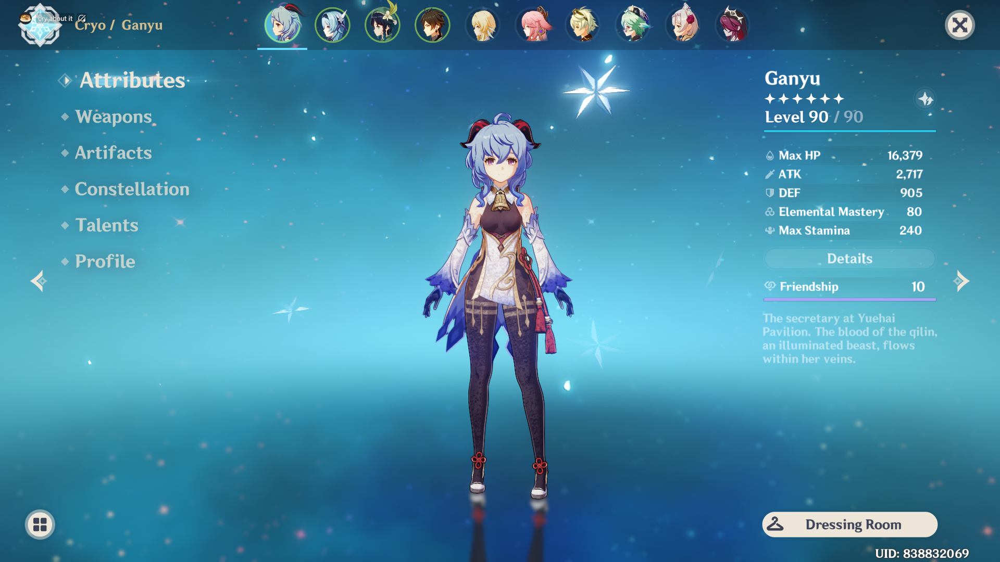

# Genshin Impact
Owned by Zach Sandia

## What is Genshin Impact?

Genshin Impact is an action role-playing game developed by Chinese developer miHoYo, and first published in 2020. The game features an anime-style open-world environment and an action-based battle system using elemental magic and character-switching.

## Some Genshin Characters I have

### Ganyu
Ganyu is a playable Cryo character in Genshin Impact. She is a half-qilin Adeptus under contract with the Geo Archon Morax and serves as the general secretary of the Liyue Qixing.

### Zhongli
Zhongli is a playable Geo character in Genshin Impact. He is a consultant of the Wangsheng Funeral Parlor. He is later revealed to be the current vessel of the Geo Archon, Morax, who has decided to experience the world from the perspective of a mortal.
![]
